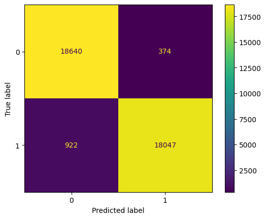

# fraud-detection

This project aims to create a machine learning algorithm to detect fraud transactions from banking services.  
The dataset used came from Kaggle dataset : https://www.kaggle.com/datasets/marusagar/bank-transaction-fraud-detection

## Situation

Nowadays, due to an evolution of the technology, digital banking emerges, leading to people making more online financial transaction.   

However, the risk of fraud transactions increased as well.  The most common fraud came from credit card fraud (use of someone's credit card without their consent), identity issue, online payment, and so on. It can occurs during a purchase, a money tranfer or even a withdrawal at the ATM.  

This situation makes the bank more exposed at safety's issues, which may tarnish the reputation of the company and lead to financial losses. 

## Task

How can we detect if a transaction is whether a fraud or not?

## Actions

1. Data Quality: 
- Loading the dataset
- Checking types of the columns
- Checking missing values

2. Feature Engineering
- Selecting objects columns where the number of unique values does not exceed 10
- Selecting the numbers columns (int and float types) 

3. Data preparation: 

- Removing outliers using Inter Quartile Range
- Encoding the categorical variables with an Ordinal Encoder
- Checking for correlation between features with a heatmap
- Standardizing the dataset (not our target: whether the transaction is a fraud or not
- Checking for imbalanced data
- Oversampling the data to have the same proportion of instances between classes
- Split the whole dataset into 3 datasets: training set, validation set, testing set

4. Training the model

- Selecting the classifiers to train : Random Forest Classifier, K-NN Classifier, Gradient Boosting Classifier
- Selecting ways to evaluate the models. Two scoring chosen to choose the best model : Recall and Accuracy. 

5. Evaluate the model

- Displaying the confusion matrix
- Printing the classification report (F1-score, Recall, Precision)
- Plotting the ROC Curve

## Results

The best performance between the three classifiers is presented by the Random Forest Classifier with an accuracy of 96.59%.  

## Lessons Learned

 
