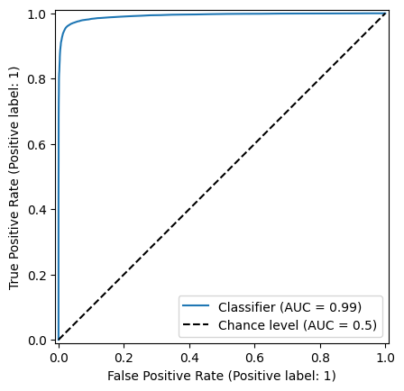

# fraud-detection

This project aims to create a machine learning algorithm to detect fraud transactions from banking services.  
The dataset used came from Kaggle dataset : https://www.kaggle.com/datasets/marusagar/bank-transaction-fraud-detection

## Situation

In today's digital age, digital banking emerges, leading to people making more online financial transaction.   

However, the risk of fraud transactions increased as well.  The most common fraud came from credit card fraud (use of someone's credit card without their consent), identity issue, online payment, and so on. It can occurs during a purchase, a money tranfer or even a withdrawal at the ATM.  

This situation makes the bank more exposed at safety's issues, which may tarnish the reputation of the company and lead to financial losses. 

## Task

How can we detect if a transaction is whether a fraud or not?

## Actions

<ins>1. Data Quality</ins>
- Loading the dataset
- Checking types of the columns
- Checking missing values

<ins>2. Feature Engineering</ins>
- Selecting objects columns where the number of unique values does not exceed 10
- Selecting the numbers columns (int and float types) 

<ins>3. Data preparation</ins>

- Removing outliers using Inter Quartile Range
- Encoding the categorical variables with an Ordinal Encoder
- Checking for correlation between features with a heatmap
- Standardizing the dataset (not our target: whether the transaction is a fraud or not
- Checking for imbalanced data
- Oversampling the data to have the same proportion of instances between classes
- Split the whole dataset into 3 datasets: training set, validation set, testing set

<ins>4. Training the model</ins>

- Selecting the classifiers to train : Random Forest Classifier, K-NN Classifier, Gradient Boosting Classifier
- Selecting ways to evaluate the models. Two scoring chosen to choose the best model : Recall and Accuracy. 

<ins>5. Evaluating the model</ins>

- Displaying the confusion matrix
- Printing the classification report (F1-score, Recall, Precision)
- Plotting the ROC Curve

## Results

The best performance between the three classifiers is presented by the Random Forest Classifier with an **accuracy of 96.59%**.  
The accuracy of a model for a classifier can be defined by the number of instances well predicted devided by the total number of instances. 

A confusion matrix compared the expected values with the predicted ones from the model. You can calculate with this some important metrics for a classifier such as F1-score, Precision or Recall.  
Increasing the accuracy involved maximizing the declining diagonal (from top left to bottom right).  

The confusion matrix of the current model shows strong performance due to a high **F1-score (=97%)** and accuracy. 

The current model is a binary classification, meaning the resulting output shown will be either 0 or 1 (0 = Not a fraud, 1 = fraud).  
In reality, the model calculates a probability for class 0 and 1; and by default, if the probability exceed a threshold of 0.5, it reprensents the class itself.  
e.g: model_prediction_proba_class_1 = 0.65 --> Prediction = Class 1.  

However, changing the threshold may lead to a better performance from the model. One way to know how to choose the threshold is by computing the ROC (Receiver Operating Characteristic) curve shown above.  
A fastest way to analyze this curve is to look at the AUC (Area Under Curve). 
Generally, the higher the area, the greater is the model.  
In our case, **AUC = 99%**.

## Lessons Learned

- Data cleaning, preparation and feature engineering are the most important steps.
- Training a model can be time-consuming. 
- Importance to document your code to be as readable as possible. An error can occur and you may have to investigate into it. 